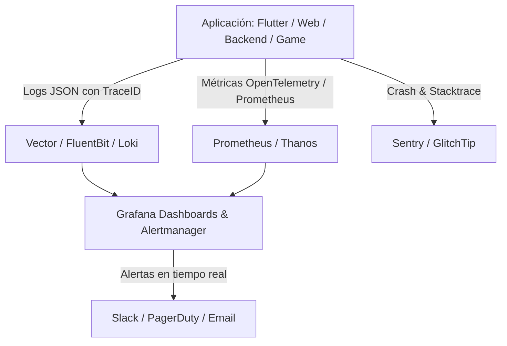

# 📊 Monitoring Agent Skill (Transversal)

> **Habilidad Transversal de Observabilidad, Telemetría, Logs Estructurados y Monitoreo Agnóstico** para Agentes de Inteligencia Artificial (Antigravity, Cursor, Claude, OpenAI, Gemini).

Designed to be **100% agnostic** across all application platforms (**Flutter, Web, Game, Backend**).

---

## 📌 Propósito y Alcance

`monitoring-agent-skill` capacita a los agentes de IA para implementar, diagnosticar y optimizar la pila de observabilidad completa del sistema:

1. **📈 4 Golden Signals (SRE)**: Rastreo y alertas basadas en Latencia, Tráfico, Errores y Saturación.
2. **🪵 Logging Estructurado (JSON)**: Estándar unificado de logs estructurados con niveles (DEBUG, INFO, WARN, ERROR, FATAL) y Context Propagation (Correlation IDs / Trace IDs).
3. **🔍 Telemetría y Tracing (OpenTelemetry)**: Trazabilidad distribuida entre apps cliente (Flutter, Web, Game) y microservicios backend.
4. **🚨 Gestión de Alertas y Desbordamiento**: Reglas de alertas preventivas para Prometheus/Alertmanager, PagerDuty, Slack o Webhooks sin fatiga por alertas.
5. **🐛 Rastreabilidad de Excepciones (Sentry/GlitchTip)**: Captura y agregación automática de crash reports en cliente y servidor con breadcrumbs contextuales.

---

## ⚡ $-Comandos de Observabilidad

| Comando | Acción | Descripción |
|---|---|---|
| `$monitoring` | **Bootstrap Monitoring** | Activa la habilidad y escanea la pila actual de observabilidad. |
| `$monitoring:audit` | **Auditoría** | Inspecciona cobertura de logs, endpoints de métricas e integración de crash reporting. |
| `$monitoring:logs` | **Esquema de Logs** | Genera o estandariza el formateador de logs estructurados JSON con Correlation ID. |
| `$monitoring:metrics` | **Prometheus/OTel** | Configura recolectores de métricas y endpoints `/metrics` estandarizados. |
| `$monitoring:sentry` | **Crash Reporting** | Configura Sentry / GlitchTip con filtrado de datos PII y captura de excepciones. |
| `$monitoring:alerts` | **Alerting Rules** | Genera reglas de alerta preventivas en Prometheus o Grafana. |

---

## 🧩 Arquitectura de Observabilidad



---

## 📦 Instalación como Submódulo

```bash
git submodule add https://github.com/xolotl-hub/monitoring-agent-skill.git .skill/monitoring-agent-skill
```

Para activar en la sesión actual:
```text
$monitoring
```
