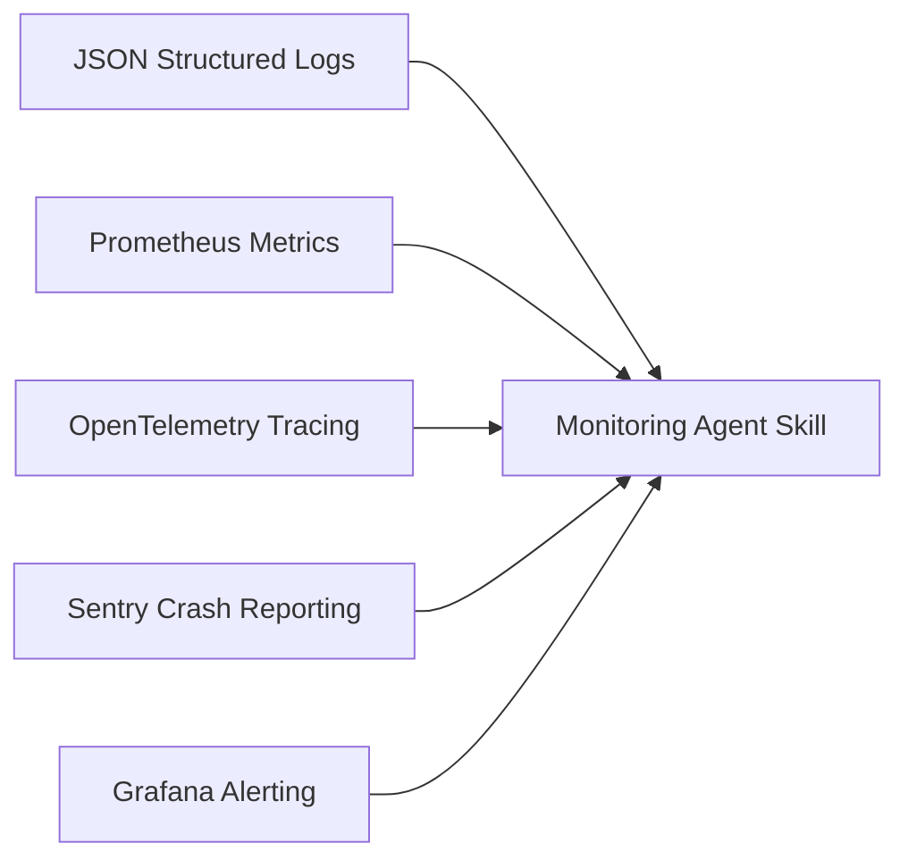

# ⚙️ Monitoring Agent Skill Matrix & Directives

## 🎯 Capacidades de la Habilidad



---

## 📋 Protocolo de Auditoría de Observabilidad (`$monitoring:audit`)

1. **Auditoría de Logging**:
   - Identificar si existen logs planos (`printf`, `System.out`, `console.log`, `print`).
   - Verificar si el Logger adjunta timestamp ISO-8601, nivel de severidad y context metadata.
2. **Auditoría de Métricas**:
   - Verificar presencia de endpoint `/metrics` en servicios backend o controladores de métricas en apps cliente.
   - Auditar métricas de Golden Signals: Latencia (Histograma), Tasa de Error (Counter 5xx), Rendimiento (RPS Counter).
3. **Auditoría de Excepciones**:
   - Validar que las excepciones no capturadas sean interceptadas por un Global Error Handler y notificadas a Sentry/GlitchTip.

---

## 🪵 Estándar Canónico de JSON Logging Schema

```json
{
  "timestamp": "2026-08-21T06:15:00.000Z",
  "level": "ERROR",
  "service": "checkout-service",
  "trace_id": "a8f9c2d1-4e5f-6a7b-8c9d-0e1f2a3b4c5d",
  "span_id": "1a2b3c4d",
  "message": "Payment processing failed",
  "error": {
    "type": "PaymentGatewayTimeoutException",
    "details": "Gateway endpoint timed out after 5000ms"
  },
  "context": {
    "user_id": "usr_991823",
    "cart_amount": 149.99
  }
}
```

---

## 🚨 Matriz de Severidad de Alertas

| Nivel | Condición | Tiempo de Respuesta | Canal de Notificación |
|---|---|---|---|
| **P1 - CRITICAL** | Tasa de error > 5% en 5 min o DB inaccesible | Inmediato (< 5m) | PagerDuty / Llamada / SMS |
| **P2 - HIGH** | Latencia p95 > 2000ms durante 10 min | < 30 minutos | Canal Slack `#alerts-urgent` |
| **P3 - MEDIUM** | Uso de Disco > 85% o Memoria > 80% | < 4 horas | Ticket JIRA / Slack `#alerts-warning` |
| **P4 - LOW** | Deprecación de API o Warning de SDK | Próximo Sprint | Email Digest semanal |


---

## 📝 Persistencia y Salida Activa (`overview/work/skill/`)

Al ejecutar esta skill (mediante `$monitoring` o `$monitoring:audit`), es **obligatorio crear o actualizar su reporte activo** dentro del proyecto cliente en la ruta:

`overview/work/skill/monitoring.md`

### Estructura Requerida del Reporte:

```markdown
# 📋 Registro Activo de Tareas — Monitoring Agent Skill

> **Generado por**: `monitoring-agent-skill` (`$monitoring:audit`)  
> **Última actualización**: YYYY-MM-DD  

## 🎯 Tareas Pendientes Accionables

| ID | Tipo | Estado | Resumen | Evidencia/Ruta | Acción Requerida |
|---|---|---|---|---|---|
| MON-01 | Fix / Refactor | Pendiente | <Resumen breve> | `<ruta:línea>` | <Remediación recomendada> |

## 📝 Observaciones y Detalles de Revisión
- Detalle técnico, evidencia o contexto extendido proporcionado por la revisión de la skill.
```
